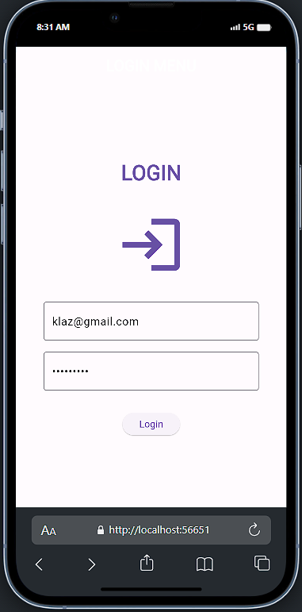
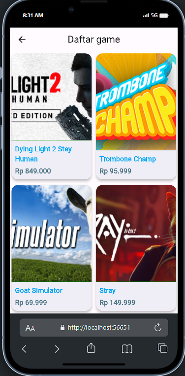
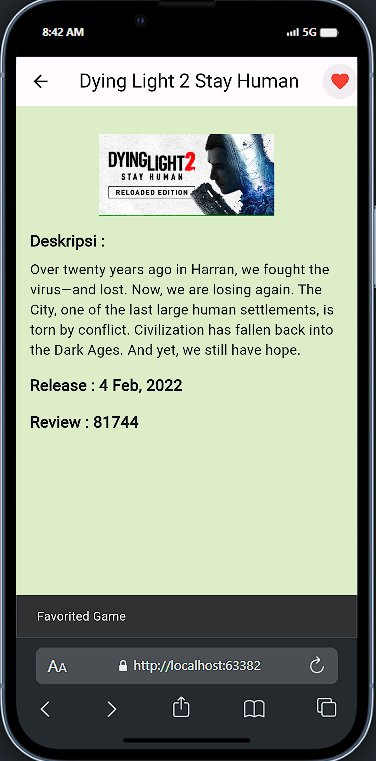

# Quiz

## Deskripsi
Buatlah aplikasi mobile yang menampilkan daftar games yang terdapat pada data yang sudah disediakan dengan persyaratan sebagai berikut.  
**Question :**
  - Buatlah aplikasi mobile yang menampilkan daftar games yang terdapat pada data yang sudah disediakan. 
  -	Gunakan setidaknya 2 halaman (List dari semua games dan detail dari sebuah game). 
  -	Menggunakan data yang disediakan. 
  -	Tampilan UI dibuat sebaik mungkin. 
  -	Kode harus dalam kondisi rapih dan memanfaatkan beberapa file/class/fungsi yang berbeda.

  -	Tidak terdapat error pada aplikasi.

**Page Detail :**
  -	Halaman Daftar Games, menampilkan daftar games menggunakan GridView dan setiap baris maksimal terdiri dari 2 item. Setiap item menampilkan cover, title, dan price (boleh menambahkan informasi lain seperti reviews) (Boleh menggunakan InkWell, GridTile, GridTileBar, dll).
  -	Saat salah satu game item dari daftar game ditekan, akan berpindah ke sebuah halaman detail dari game yang ditekan sebelumnya.
  -	Halaman Detail Game, menampilkan title dari game pada AppBar, menampilkan image, title, description, genre, release date, dan reviews pada body, terdapat sebuah tombol yang jika ditekan akan membuka link eksternal menuju halaman game store.

**Poin tambahan :**
  -	Buatlah tombol (toggle) favorite pada AppBar yang jika ditekan akan merubah warna dari tombol favorite tersebut (gunakan icon berbentuk hati). 
  -	Layout tampilan yang responsif.

  <h1>Tampilan</h1>

  &nbsp;
  &nbsp;
  &nbsp;

